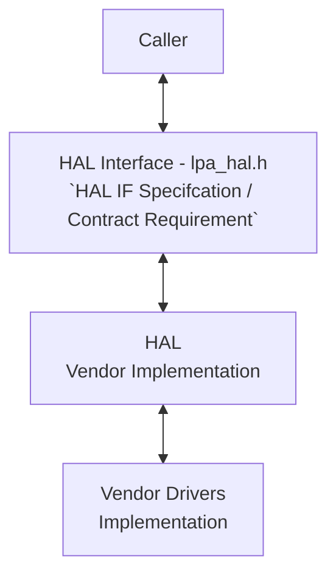

# LPA HAL Documentation

## Acronyms

- `HAL` \- Hardware Abstraction Layer
- `RDK-B` \- Reference Design Kit for Broadband Devices
- `OEM` \- Original Equipment Manufacture
- `LPA` \- Local Profile Assistants

## Description

The LPA (Local Profile Assistant) HAL module provides a standardized interface for managing and controlling power states of devices in the RDK ecosystem. It acts as an intermediary between the power management software and the underlying hardware, simplifying the complexities associated with different power states and transitions.

### Key Functionalities of the LPA HAL

- **Power State Management:** Enables transitioning between various power states (e.g., active, standby, sleep) based on system requirements and user preferences.
- **Wake Events:** Configures and handles wake-up events from multiple sources like timers, network activity, or external triggers.
- **Resource Control:** Allows control over device resources during different power states (e.g., disabling unused components, adjusting clock speeds) to optimize power consumption.
- **Monitoring:** Monitors power-related parameters like battery level, current consumption, and temperature to ensure safe and efficient operation.
- **Notifications:** Provides notifications to applications about changes in power state or other power-related events.
  
With this abstraction, the LPA HAL enhances the development of power-aware applications, offering greater flexibility in managing device power consumption, which leads to improved energy efficiency, extended battery life (in battery-powered devices), and an enhanced user experience.

The diagram below illustrates the high-level software architecture of the Lpa HAL module stack, demonstrating how it fits within the broader system context.



## Component Runtime Execution Requirements

### Initialization and Startup

There is no dependent API's is expected to be intialized for invoking the client module. But below API is used to setup the LPA SDK parameters

- `cellular_esim_lpa_init()`

Third-party vendors must implement the interface to align with operational standards. The interface should block execution if the necessary hardware is unavailable.

## Threading Model

The interface is not required to be thread-safe.

Vendors can implement internal threading and event mechanisms for operational purposes. These mechanisms must ensure thread safety when interacting with the provided interface. Additionally, they must guarantee cleanup of resources upon closure.

## Process Model

API's are expected to be called from multiple process.

## Memory Model

### Caller Responsibilities

Manage memory passed to specific functions as outlined in the API documentation. This includes allocation and proper deallocation to prevent leaks.

### Module Responsibilities

Handle and deallocate memory used for its internal operations.
Release all internally allocated memory upon closure to prevent leaks.

TODO:
State a footprint requirement. Example: This should not exceed XXXX KB.

## Power Management Requirements

The HAL is not involved in any of the power management operation.

## Asynchronous Notification Model

There are no asynchronous notifications.

## Blocking calls

APIs should operate synchronously and complete quickly. Completion time should be based on the operation's complexity and follow any defined specifications within the API's documentation.

Implement timeouts for API calls that could fail due to unresponsiveness. Refer to the API documentation for recommended timeout values.

Since this API will be called from a single-threaded environment, it must not block or suspend execution.

TODO: As we state that they should complete within a time period, we need to state what that time target is, and pull it from the spec if required. Define the timeout requirement.

## Internal Error Handling

- **Synchronous Error Handling:** All APIs must return errors synchronously as a return value. This ensures immediate notification of errors to the caller.
- **Internal Error Reporting:** The HAL is responsible for reporting any internal system errors (e.g., out-of-memory conditions) through the return value.
- **Focus on Logging for Errors:** For system errors, the HAL should prioritize logging the error details for further investigation and resolution.

## Persistence Model

There is no requirement for HAL to persist any setting information.

## Nonfunctional requirements

Following non functional requirement should be supported by the component.

## Logging and debugging requirements

The LPA HAL component is required to record all errors and critical informative messages to aid in identifying, debugging, and understanding the functional flow of the system. Logging should be implemented using the `syslog` method, as it provides robust logging capabilities suited for system-level software. The use of printf is discouraged unless syslog is not available.

All HAL components must adhere to a consistent logging process. When logging is necessary, it should be performed into the `lpa_vendor_hal.log` file, which is located in either the `/var/tmp/` or `/rdklogs/logs/` directories.

Logs must be categorized according to the following log levels, as defined by the Linux standard logging system, listed here in descending order of severity:

- **FATAL:** Critical conditions, typically indicating system crashes or severe failures that require immediate attention.
- **ERROR:** Non-fatal error conditions that nonetheless significantly impede normal operation.
- **WARNING:** Potentially harmful situations that do not yet represent errors.
- **NOTICE:** Important but not error-level events.
- **INFO:** General informational messages that highlight system operations.
- **DEBUG:** Detailed information typically useful only when diagnosing problems.
- **TRACE:** Very fine-grained logging to trace the internal flow of the system.

Each log entry should include a timestamp, the log level, and a message describing the event or condition. This standard format will facilitate easier parsing and analysis of log files across different vendors and components.

## Memory and performance requirements

The component should not contributing more to memory and CPU utilization while performing normal operations and commensurate with the operation required.

## Quality Control

To ensure the highest quality and reliability, it is strongly recommended that third-party quality assurance tools like `Coverity`, `Black Duck`, and `Valgrind` be employed to thoroughly analyze the implementation. The goal is to detect and resolve potential issues such as memory leaks, memory corruption, or other defects before deployment.

## Licensing

Lpa HAL implementation is expected to released under the Apache License 2.0.

## Build Requirements

The source code should be capable of, but not be limited to, building under the Yocto distribution environment. The recipe should deliver a shared library named as `libesim_lpa.so`
  
## Variability Management

Changes to the interface will be controlled by versioning, vendors will be expected to implement to a fixed version of the interface, and based on SLA agreements move to later versions as demand requires.

Each API interface will be versioned using [Semantic Versioning 2.0.0](https://semver.org/), the vendor code will comply with a specific version of the interface.

## Platform or Product Customization

None

## Interface API Documentation

All HAL function prototypes and datatype definitions are available in `lpa_hal.h` file.

1. Components/Process must include lpa_hal.h to make use of Lpa hal capabilities.
2. Components/Process should add linker dependency for `libesim_lpa.so.`

## Theory of operation and key concepts

To provide stakeholders with a comprehensive understanding of how the interfaced components within the LPA HAL function. This understanding is crucial for effective integration and troubleshooting.

### Object Lifecycles

Each object within the LPA HAL component is designed with a specific lifecycle, which details how objects are created, used, and destroyed. The lifecycle management of these objects includes:

- **Creation:** Objects are instantiated with initial configuration parameters.
- **Usage:** Throughout their lifecycle, objects might be re-configured or interacted with through various methods.
- **Destruction:** Objects are destroyed when they are no longer needed, freeing up resources. Each object has a unique identifier that remains consistent across its lifecycle, enabling traceable interactions and modifications.

### Method Sequencing

Certain operations within the LPA HAL must occur in a specific sequence to ensure proper functionality:

- **Initialization:** All primary components must be initialized before they can be configured or used. This process involves setting initial states and loading necessary resources.
- **Configuration:** After initialization, components must be configured with specific settings that dictate their operation.
- **Operational Use:** Once initialized and configured, components can perform their designated tasks.

### State-Dependent Behavior

The behavior of components in the LPA HAL is dependent on their current state, governed by a state model:

- **State Model:** A predefined model outlines possible states of the components and the valid transitions between these states.
- **Method Restrictions:** Certain methods within the component can only be invoked when the component is in particular states. For example, configuration methods may only be accessible when a component is in an 'uninitialized' or 'idle' state.

## Sequence Diagram

```mermaid
sequenceDiagram
participant Caller
participant Lpa HAL
participant Vendor
Caller->>Lpa HAL: cellular_esim_lpa_init()
Lpa HAL->>Vendor: 
Vendor ->>Lpa HAL: 
Lpa HAL->>Caller: cellular_esim_lpa_init() return
Caller->>Lpa HAL: cellular_esim_get_XXX()
Lpa HAL->>Vendor: 
Vendor ->>Lpa HAL: 
Lpa HAL->>Caller: cellular_esim_get_XXX() return
Caller->>Lpa HAL: cellular_esim_XXXX_profile()
Lpa HAL->>Vendor: 
Vendor ->>Lpa HAL: 
Lpa HAL->>Caller: cellular_esim_XXXX_profile() return
Caller->>Lpa HAL: cellular_esim_download_profile_XXX()
Lpa HAL->>Vendor: 
Vendor ->>Lpa HAL: 
Lpa HAL->>Caller: cellular_esim_download_profile_XXX() return
Caller->>Lpa HAL: cellular_esim_lpa_exit()
Lpa HAL->>Vendor: 
Vendor ->>Lpa HAL: 
Lpa HAL->>Caller: cellular_esim_lpa_exit() return
