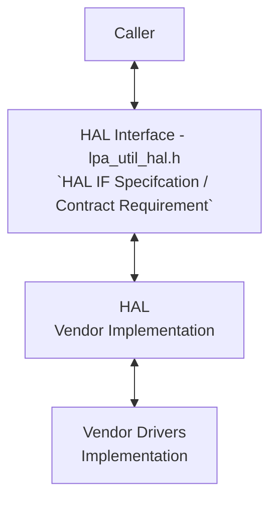
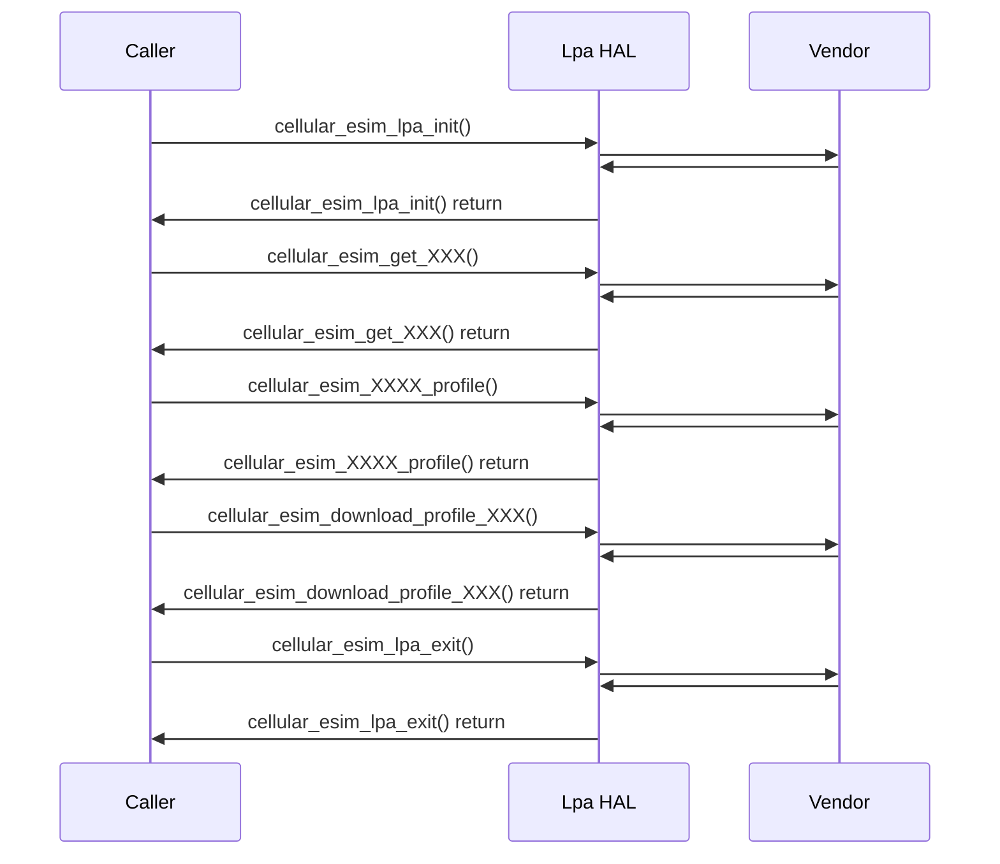

# LPA HAL Documentation

## Acronyms

- `HAL` \- Hardware Abstraction Layer
- `RDK-B` \- Reference Design Kit for Broadband Devices
- `OEM` \- Original Equipment Manufacture
- `LPA` \- Local Profile Assistants

## Description
The diagram below describes a high-level software architecture of the Lpa HAL module stack. 

Lpa HAL is an abstraction layer, implemented to interact with vendor software's for getting the details of the profiles on the eSIM.

## Component Runtime Execution Requirements

### Initialization and Startup

There is no dependent API's is expected to be intialized for invoking the client module. But below API is used to setup the LPA SDK parameters
- `cellular_esim_lpa_init()`

3rd party vendors will implement appropriately to meet operational requirements. This interface is expected to block if the hardware is not ready.

## Threading Model

The interface is not required to be thread-safe.

Any module which is invoking the Lpa Hal API should ensure calls are made in a thread safe manner.

Vendors can create internal threads/events to meet their operation requirements.  These should be responsible to synchronize between the calls, events and cleaned up on closure.

## Process Model

API's are expected to be called from multiple process.

## Memory Model

### Caller Responsibilities:

Manage memory passed to specific functions as outlined in the API documentation. This includes allocation and proper deallocation to prevent leaks.

### Module Responsibilities:

Handle and deallocate memory used for its internal operations.
Release all internally allocated memory upon closure to prevent leaks.

TODO:
State a footprint requirement. Example: This should not exceed XXXX KB.

## Power Management Requirements

The HAL is not involved in any of the power management operation.

## Asynchronous Notification Model

There are no asynchronous notifications.

## Blocking calls

APIs should operate synchronously and complete quickly. Completion time should be based on the operation's complexity and follow any defined specifications within the API's documentation.

Implement timeouts for API calls that could fail due to unresponsiveness. Refer to the API documentation for recommended timeout values.

Since this API will be called from a single-threaded environment, it must not block or suspend execution.

TODO: As we state that they should complete within a time period, we need to state what that time target is, and pull it from the spec if required. Define the timeout requirement.

## Internal Error Handling

All the Lpa HAL API's should return error synchronously as a return argument. HAL is responsible to handle system errors(e.g. out of memory) internally.

## Persistence Model

There is no requirement for HAL to persist any setting information. The caller is responsible to persist any settings related to their implementation.

## Nonfunctional requirements

Following non functional requirement should be supported by the component.

## Logging and debugging requirements

The LPA HAL component must record all errors and critical informative messages. This can be achieved by using either the printf or the syslog method. These tools are useful in identifying, and debugging the issues and understanding the functional flow of the system.

It is recommended that each HAL component follows the same logging process. If logging is required, vendors should log in to the `lpa_vendor_hal.log` file, which can be found in the `/var/tmp/` or `/rdklogs/logs/` directories.  

Logging should be defined with log levels as per Linux standard logging. The logging levels specified by the Linux standard logging, in descending order of severity, are FATAL, ERROR, WARNING, NOTICE, INFO, DEBUG, TRACE.

## Memory and performance requirements

The component should not contributing more to memory and CPU utilization while performing normal operations and commensurate with the operation required.

## Quality Control

LPA HAL implementation should pass checks using any third party tools like `Coverity`, `Black duck`, `Valgrind` etc. without any issue to ensure quality.

Both HAL wrapper and 3rd party software implementations should prioritize robust memory management to guarantee leak-free and corruption-resistant operation.

## Licensing

Lpa HAL implementation is expected to released under the Apache License 2.0. 

## Build Requirements

The source code should be able to be built under Linux Yocto environment and should be delivered as a shared library named as `libesim_lpa.la`
  
## Variability Management

Changes to the interface will be controlled by versioning, vendors will be expected to implement to a fixed version of the interface, and based on SLA agreements move to later versions as demand requires.

Each API interface will be versioned using [Semantic Versioning 2.0.0](https://semver.org/), the vendor code will comply with a specific version of the interface.

## Platform or Product Customization

None

## Interface API Documentation

All HAL function prototypes and datatype definitions are available in `lpa_hal.h` file.
    
1. Components/Process must include lpa_hal.h to make use of Lpa hal capabilities.
2. Components/Process should add linker dependency for `libesim_lpa.la.`

## Theory of operation and key concepts

Covered as per "Description" sections in the API documentation.

## Sequence Diagram

